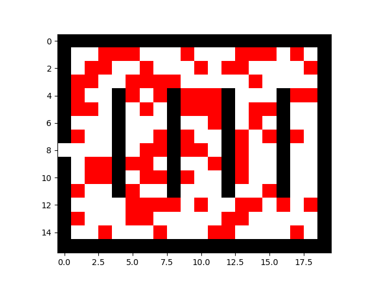
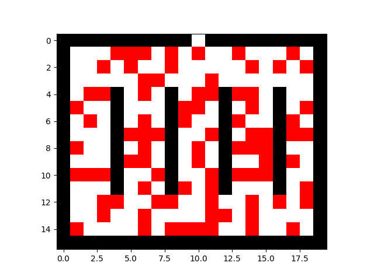
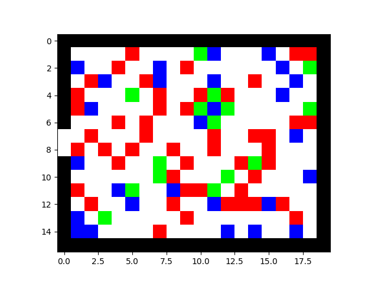

# FireEvacSim

FireEvacSim is a Python-based crowd evacuation simulator using grid-based movement and obstacle-aware pathing.
The workspace includes two simulation variants:

- `BaseModel.py`: baseline evacuation model.
- `ExpandedModel.py`: extended model with panic/calm state behavior.

## Project Structure

- `BaseModel.py` - baseline simulation and plotting.
- `ExpandedModel.py` - expanded simulation with person state dynamics.
- `gifs/` - generated simulation animations.
- `README.md` - project documentation.

## Setup

Use your project virtual environment (already present in this workspace) and install required packages:

```bash
pip install numpy matplotlib celluloid
```

## Run

Run either model directly:

```bash
python BaseModel.py
python ExpandedModel.py
```

Both scripts can generate GIF animations when `gen_gif=True` in `run_sim(...)`.
GIFs are saved to `gifs/` (created automatically if missing).

## Simulation GIFs

### Base Model

Door at `[8, 0]` (Bad placement):



Door at `[0, 10]` (Good placement):



### Expanded Model

Example expanded simulation which showcases panic as the cause of exit blockage:


